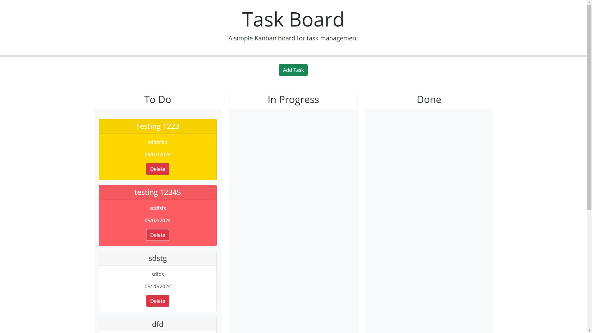

# task-board
The goal of this project was to create a task board so that a user could add project tasks, and manage their state of progress and track their projects progress.  The page needed to be able take user input from a modal form, store the inputs in local storage, place the user input in the appropriate sections as a card, and have the user input cards be draggable.  

This application is a webpage of a task board. 

There were many challenges that I faced while creating this task board.  One challenge was using day.js to format the color of the card.  I solved this challenge by using the isAfter and isSame command, to compare the due date and the current date. 

[Task Board Deployable Link](https://emmanueljatto.github.io/task-board/)

